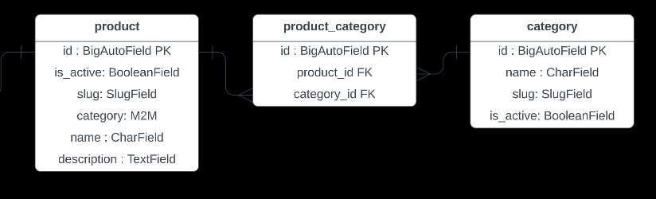

<div id="top"></div>


<div style="text-align:center"></div>


<!-- ABOUT THE PROJECT -->
## E-ventory

This repository contains the complete lifecycle of an inventory database,
including design, implementation, and querying stages. To construct the
database, we first analyze the requirements and then build it using Django. Once
the database is in place, we use Django's ORM (Object Relational Mapper) to
query it efficiently.


<!-- PURPOSE OF THE PROJECT -->
## Purpose

The purpose of the e-commerce inventory database is to maintain the product data
and supply information to our customers and management services.


<!-- OBJECTTIVES -->
## Objectives

- Maintain complete product information
- Keep track of product inventory
- Produce product and corresponding sub-product information

<!-- USER REQUIREMENTS -->
## User Requirements

- Return a list of all products
- Return a list of products by category
- Return a list of products by product attribute
- Return a list of products on promotion
- Return a list of new products
- Sort a list of products by date
- Sort a list of products by price
- Return a single product
- Add a review for a product


<!-- BUSINESS REQUIREMENTS -->
## Business Requirements

- Add, Update or Delete new products
- Add, Return or Update details related to product stock levels
- Report: Return a list of total products sold per product
- Report: Return a list of newly added products for a given timeframe
- Report: Return a list of low or not in-stock products.


<!-- SYSTEM REQUIREMENTS -->
##  System Requirements

- Return product data and images
- Return a single product and associated sub-product.

<p align="right">(<a href="#top">back to top</a>)</p>

<!-- DESIGN -->
## 1. Designing the Database

### <ins>1.1 Preliminary Fields</ins>
Defining the preliminary field list after analysing the requirements.


Note: "product image" is going to be a url.


|   Preliminary Field List    |
| :-------------------------: |
|        product name         |
|     product description     |
|    product category name    |
|        product price        |
|   product attribute name    |
|   product attribute value   |
|       promotion price       |
|      promotion active       |
|     product date added      |
|   number of products sold   |
| number of products in stock |
|   date last stock checked   |
|        product image        |


### <ins>1.2 Identifying Entities</ins>
It is possible to form 5 entities after analysing the preliminary field list.
These are:
- product
- sub-product
- category
- promotion
- attribute

Here is what the "Product" entity might look like:

|           Product           |
| :-------------------------: |
|        product name         |
|     product description     |
|        product price        |
|     product date added      |
|   number of products sold   |
| number of products in stock |
|   date last stock checked   |
|        product image        |

The "Category" entity:

|       Category        |
| :-------------------: |
| product category name |

The "Promotion" entity is a completely new subject for the database. We can
easily separate it:

|    Promotion     |
| :--------------: |
| promotion price  |
| promotion active |

The "Attribute" entity is reasonable to create at this point and not have it
inside the "Product" table, because the "attribute" will have it's own fields,
"name and value".

|        Attribute        |
| :---------------------: |
| product attribute name  |
| product attribute value |

There will also be a "Sub-product" table, although it's attributes will be
identified later.


### <ins>1.3 Refining Entities and Attributes</ins>

Looking at the "Product" entity. The "product image" attribute will cause data
redundancy since it will cause the entity to have a multi-valued attribute. It
will be ideal to have a separate entity for the image.

|                Image                |
| :---------------------------------: |
|   image url                         |
|   image name                        |
|   alternative text                  |

The "Product" entity seems to have attributes that only relate to checking
stock. These fields are "number of products in stock", "data last stock
checked". They should have their own entity. We can also add the name of the
person who has checked the stock.

|               Stock_Check             |
| :-----------------------------------: |
|   date last stock checked             |
|   date stock checked by               |
|   product stock quantity              |
|   stock check by                      |

Obviously, creating the "stock check by" field will require a new employee
entity. We can simply construct one, like so:

|        Employee               |
| :---------------------------: |
|   name                        |
|   address                     |
|   telephone number            |

The "Employee" entity can still be broken down into more attributes. "name" can
be turned into "firstname" and "surname". Of course, it is a bad practice to use
"address" on its own as well, that needs to be broken down too. Either way, for
this project, it is not required to have an "Employee" entity. The "Promotion"
and "Employee" entities are out of scope for this project. For a Django project,
the User table will be built-in.

|         Attribute             |
| :---------------------------: |
|    product attribute name     |
| product attribute description |

The value is now in a different table and a relationship is established later.

|       Attribute Value         |
| :---------------------------: |
|   product attribute value     |

Instead of having two different tables called "Product" and "Sub-product", we
can use better naming and have a new table that suits better to the project as a
whole by considering other connections such as the "Stock_Check" table. Since we
will be considering an inventory application, we can form a table called
"Inventory" instead of "Sub-product" and keep all of it's data in there.

|           Inventory           |
| :---------------------------: |
|   product price               |
|   product date added          |
|   number of products sold     |


### <ins>1.4 Establishing Keys</ins>

Django automatically created a Primary Key with the id BigAutoField right after
migrating to the database if the PK is not assigned manually.


### <ins>1.5 Field Specifications</ins>

Each attribute field looks straightforward but there is one field we need to
add, to make the "Product" entity easier to reach by the user.

Therefore, adding the UUID (Universal Unique Identifier) to the "Product" table.

|           Product           |
| :-------------------------: |
|     id : BigAutoFeild PK    |
|       UUID : UUIDField      |
|       name : CharField      |
|  product_desc : TextField   |

For querying we can still use the "id" field. However, the "UUID" field will be
unique throughout the project and even though it will have negative effects for
search optimization, it will be served more easily.


### <ins>1.6 Relationships</ins>

One important relationship to point out is between the "Inventory" and "Product"
table. In section 1.3, we established why we renamed the "Sub-product" field to
"Invetory". Now while creating the relationship, we should observe the
connection by assuming the "Inventory" table is a sub-product. Therefore,
1:Product will have Many:Sub-products. For instance, if we have a product called
"Brandname Keybord", that product will (might) have different colors. Although,
that specific color, let's say "Green Brandname Keyboard" will be related to
only one product that is "Brandname Keyboard".

Another relationship to consider is between "Category" and "Product", which is
going to be a many-to-many relationship, but which table will need to have the
M2M Field? We need to consider dependencies:
- Could we have a product without a category? No.
- Could we have a category without a product? Yes.

As a result, the dependency is prevalent on the product table. That's why the
M2M Field goes into "Product".


### <ins>1.7 Finalizing the Design</ins>

<div style="text-align:center"></div>


## Activating the Virtual Environment

### <ins>Linux & macOS</ins>
```bash
$ source my_venv/bin/activate
```

### <ins>Windows</ins>
```bash
$ .\venv\Scripts\activate
```

<p align="right">(<a href="#top">back to top</a>)</p>

## 2. Building the Tables and Fields in Django

After initialising a Django project and creating an app called "inventory", we
can start creating the tables by looking at the database design in section 1.7.

The starting strategy to design data models in Django is to keep in mind the
dependencies of each table. A table without any dependencies, possible located
at the edge of the diagram, would be a good table to start. For instance, the
"Category" table. It has 3 fields + Django's automatically created "id" field
for the Primary Key.

```python
class Category(models.Model):
    name = models.CharField(max_length=50)
    slug = models.SlugField()
    is_active = models.BooleanField()

    class Meta:
        verbose_name_plural = "Categories"

    def __str__(self):
        return self.name
```

After completing the "Category" table, we might start looking at the building
the relationship with the "Product" table now. (We do not need to build the
"product_category" table, as that Join Table will be handled by Django.)

```python
class Product(models.Model):
    name = models.CharField(max_length=50)
    description = models.TextField()
    slug = models.SlugField()
    is_active = models.BooleanField()

    category = models.ManyToManyField(Category)

    def __str__(self):
        return self.name
```

According to the design, we cannot build the "Inventory" table at this point,
since the following tables are dependent on it:

```python
class Attribute(models.Model):
    name = models.CharField(max_length=50)
    description = models.TextField()

    def __str__(self):
        return self.name
```

Going towards the "Inventory" table:

```python
class AttributeValue(models.Model):
    value = models.CharField(max_length=50)

    attribute = models.ForeignKey(
        Attribute, related_name="attribute", on_delete=models.CASCADE
    )

    def __str__(self):
        return self.value
```

We have covered all the dependent tables. (Again, the Join Table,
"inventory_attribute_values", is handled by Django.) It is time to build the
"Inventory" table.

```python
class Inventory(models.Model):
    is_active = models.BooleanField()
    is_default = models.BooleanField()
    price = models.DecimalField(
        max_digits=5,
        decimal_places=2,
    )
    created_at = models.DateTimeField(auto_now_add=True, editable=False)
    sku = models.CharField(
        max_length=20,
        unique=True,
    )

    product = models.ForeignKey(
        Product, related_name="product", on_delete=models.CASCADE
    )
    attribute_values = models.ManyToManyField(AttributeValue)

    class Meta:
        verbose_name_plural = "Inventory"

    def __str__(self):
        return self.product.name
```

Finally we can build the remaining 1:1 tables:

```python
class StockControl(models.Model):
    last_checked = models.DateTimeField(auto_now_add=False, editable=False)
    units = models.IntegerField(default=0)

    inventory = models.OneToOneField(Inventory, related_name="inventory",on_delete=models.CASCADE)

    class Meta:
        verbose_name_plural = "Stock Control"


class Image(models.Model):
    url = models.ImageField(upload_to=None)
    alternative_text = models.CharField(max_length=50)
    is_feature = models.BooleanField()
    inventory = models.ForeignKey(Inventory, on_delete=models.CASCADE)
```

<p align="right">(<a href="#top">back to top</a>)</p>


## 3. Manual Data Insertion w/ Admin Site

The admin page is adjusted with "TabularInLine" to ease the process of adding
new data to the database. Check admin.py inside of the "inventory" app.

> Go to port:port/admin to manually add your data.

<p align="right">(<a href="#top">back to top</a>)</p>


## 4. Automatic Data Insertion w/ Django Fixtures

Importing data into the database can be done by using fixtures. In this project,
we have 10 fixtures, can be inserted through /inventory/fixtures/.

To apply these fixtures, we have a management command inside
/inventory/management/commands/load-fixtures.py.

Run all the commands with:
```bash
$ python manage.py load-fixtures
```

<p align="right">(<a href="#top">back to top</a>)</p>


## 5. Querying Data w/ Django's ORM

To get started run Django's shell:
```bash
python manage.py shell
```

Import the models from the "inventory" app:
```bash
>>> from eventory.inventory.models import Category, Product, Attribute, AttributeValue, Inventory, StockControl, Image
```


### <ins>5.1 Pretty Print - SQL</ins>
We are going to be analysing the SQL version of the ORM queries. To get clean
outputs, we need the following packages: 
- [Pygments](https://pypi.org/project/Pygments/)
- [sqlparse](https://pypi.org/project/sqlparse/)

```bash
pip install Pygments
pip install sqlparse
```

After installing the packages, import them (depending on the database you use,
import it's Lexer)
```bash
>>> from pygments import highlight
>>> from pygments.formatters import TerminalFormatter
>>> from pygments.lexers import PostgresLexer
>>> from sqlparse import format
```

### <ins>5.2 Retrieve all objects from a table</ins>

To retrieve all the records from a table, use the .all() method.
```python
Category.objects.all() 
```
These methods will return a QuerySet. If you want to see how Django's ORM
translates this into SQL queries:

```python
sqlformatted = format(str(x.query), reindent=True)
```

Now, output the query:

```python
print(highlight(sqlformatted, PostgresLexer(), TerminalFormatter()))
```

>OUTPUT:
```sql
SELECT "inventory_category"."id",
       "inventory_category"."name",
       "inventory_category"."slug",
       "inventory_category"."is_active"
FROM "inventory_category"
```

To get the number of records:
```python
Category.objects.all().count()
```

### <ins>5.3 Retrieve a Record w/ a Relation</ins>

> Child to Parent
<p align="center">
  
</p>

Let's grab how many products are in the category id=1 ("fashion").

```python
Product.objects.filter(category__id=1).count()
```

> OUTPUT:

```python
9
```

The ".count()" is part is Python code. The rest of the code is turned into SQL
by the ORM.

The SQL query for the operation above looks like this:

```python
SELECT "inventory_product"."id",
       "inventory_product"."name",
       "inventory_product"."description",
       "inventory_product"."slug",
       "inventory_product"."is_active"
FROM "inventory_product"
INNER JOIN "inventory_product_category" ON ("inventory_product"."id" = "inventory_product_category"."product_id")
WHERE "inventory_product_category"."category_id" = 1
```

### <ins>5.4 Retrieve a Record w/ an Inverse Relation</ins>
> Parent to Child

<p align="center">
  
</p>

From "Attribute" parent model to the "AttributeValue" child model (Naming fits
the model, not the diagram):

```python
Attribute.objects.filter(attribute__value=5)
```

> OUTPUT:
```bash
woman-shoe-size
```

The SQL query for this code:

```sql
SELECT "inventory_attribute"."id",
       "inventory_attribute"."name",
       "inventory_attribute"."description"
FROM "inventory_attribute"
INNER JOIN "inventory_attributevalue" ON ("inventory_attribute"."id" = "inventory_attributevalue"."attribute_id")
WHERE "inventory_attributevalue"."value" = 5
```

### <ins>5.5 Retrieve all the products w/ price greater than 80</ins>

<p align="center">
  
</p>

"Inventory" holds all the records of the products, as discussed previously, now
we need to specify a price range.

```python
x = Product.objects.filter(product__price__gt=80) 
```

> OUTPUT:

```bash
<QuerySet [<Product: widstar running sneakers>, <Product: girl zada gray flip flop sandal>, <Product: girl primotoo open toe synthetiflip flop sandal>]>
```

If you would like to extract the data into a list:

```python
product_names = [product.name for product in x]
```

The SQL for this code:

```sql
SELECT "inventory_product"."id",
       "inventory_product"."name",
       "inventory_product"."description",
       "inventory_product"."slug",
       "inventory_product"."is_active"
FROM "inventory_product"
INNER JOIN "inventory_inventory" ON ("inventory_product"."id" = "inventory_inventory"."product_id")
WHERE "inventory_inventory"."price" > 80
```

### <ins>5.6 Retrieve all the products that are stocked checked in the last week</ins>

<p align="center">
  
</p>

The relationship between the "Inventory" model and the "StockControl" model will
manage the query.

```python
x = Inventory.objects.filter(inventory__last_checked__range=('2021-09-01','2021-09-8')) 
```

The output is too long, instead we will display the number of records using
.count().

> OUTPUT:

```bash
49
```

The SQL for this code:

```sql
SELECT "inventory_inventory"."id",
       "inventory_inventory"."is_active",
       "inventory_inventory"."is_default",
       "inventory_inventory"."price",
       "inventory_inventory"."created_at",
       "inventory_inventory"."sku",
       "inventory_inventory"."product_id"
FROM "inventory_inventory"
INNER JOIN "inventory_stockcontrol" ON ("inventory_inventory"."id" = "inventory_stockcontrol"."inventory_id")   
WHERE "inventory_stockcontrol"."last_checked" BETWEEN 2021-09-01 00:00:00 AND 2021-09-08 00:00:00
```

### <ins>5.7 Retrieve all the products that are stock checked in the last week AND almost out</ins>

The same logic applies again (from section 5.6), the only difference being the
unit amount needs to be checked. Instead of using "less than", we might want to
use .exclude() by chaining it to the end. At first, this might seem like a operation with +O(n) for the
memory. However, Django does not import the entire table at first and exclude
the ones that do not meet the requirement. Instead, all of the statement gets
converted into an SQL query which is more compact and not memory intensive.

```python
product = Inventory.objects.filter(inventory__last_checked__range=('2021-09-01','2021-09-8')).exclude(inventory__units__gt=10)
```

> OUTPUT:

```bash
<QuerySet [<Inventory: girl primotoo open toe synthetiflip flop sandal>, <Inventory: axny anise round toe synthetianke boot>, <Inventory: axny graham round toe synthetimid caf boot>, <Inventory: axny tuner round toe synthetibootie>, <Inventory: aerosoes rock soid natura fabric>]>
```

If you want to output each item's name and amount left in a tuple, first we need
to traverse to the "Product" model and grab the name using the
related_name="product" field. Then we need to reach to the "StockControl" model
by using the 1:1 related_name="inventory" field.


```python
need_restock_on = [(product.product.name,product.inventory.units) for product in x] 
```

> OUTPUT:

```bash
[('girl primotoo open toe synthetiflip flop sandal', 2), ('axny anise round toe synthetianke boot', 3), ('axny graham round toe synthetimid caf boot', 5), ('axny tuner round toe synthetibootie', 5), ('aerosoes rock soid natura fabric', 1)]
```


<!-- CONTACT -->
## Contact

Erol Gelbul - [Website](erolgelbul.com)

Project Link: [E-ventory](https://github.com/ErolGelbul/e-ventory)

<p align="right">(<a href="#top">back to top</a>)</p>


<!-- MARKDOWN LINKS & IMAGES -->
